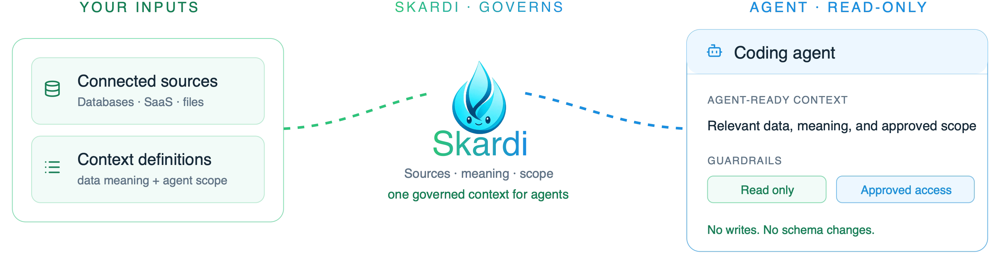

<div align="center">

<picture>
  <source media="(prefers-color-scheme: dark)" srcset="asset/controlled-db-debugging-hero-dark.png">
  
</picture>

<br>

<p align="center">
  <strong>Star Skardi ❤️ →</strong>&nbsp;
  <a href="https://github.com/SkardiLabs/skardi" title="Star Skardi on GitHub"></a>&nbsp;·&nbsp;
  <a href="https://www.skardi.ai/" title="Visit skardi.ai"></a>&nbsp;·&nbsp;
  <a href="https://skardilabs.github.io/skardi-docs/docs/intro" title="Read the Skardi documentation"></a>&nbsp;·&nbsp;
  <a href="https://discord.gg/S5YQQPEV2m" title="Join the Skardi Discord community"></a>
</p>

# Give coding agents context they can trust.

**Skardi turns the data you approve into governed context for coding agents.** Define which sources an agent may use, explain the business meaning of every table and field, and expose only the read-only queries or pipelines it needs—so agents can work from context they can trust without broad database access.

<p align="center">
  <a href="https://github.com/SkardiLabs/skardi/stargazers"></a>
  <a href="https://github.com/SkardiLabs/skardi/actions/workflows/ci.yml"></a>
  <a href="https://crates.io/crates/skardi"></a>
  <a href="LICENSE"></a>
  <a href="https://discord.gg/S5YQQPEV2m"></a>
</p>

<p align="center"><strong>English</strong>&nbsp;·&nbsp;<a href="README.zh-CN.md">简体中文</a></p>

</div>

---

## Quick start

Clone Skardi, start a server over the sample data already included in the repository, and run a read-only query against it from the CLI.

Skardi has two binaries, and the split matters: `skardi-server` holds the query engine and the registered sources, and `skardi` is a thin HTTP client that sends every command to a running server. The CLI has no engine of its own, so a server comes first.

Nothing below is compiled: the server runs as a container image and the CLI is a pre-built binary.

### 1. Clone the repository

`data/products.csv` and the context file that registers it are both in the repository, so there is nothing else to download:

```bash
git clone https://github.com/SkardiLabs/skardi.git
cd skardi
```

### 2. Start a server on the built-in sample

`-v "$PWD":/w:ro` gives the container read-only access to the repository you just cloned, and `-w /w` makes the paths in the command resolve against it:

```bash
docker run -d --name skardi -p 8080:8080 \
  -v "$PWD":/w:ro -w /w \
  ghcr.io/skardilabs/skardi/skardi-server:latest \
  --ctx docs/basic/ctx.yaml --port 8080
```

### 3. Query it from the CLI

Download the CLI for your platform, then point it at the server you just started:

```bash
curl -sL https://github.com/SkardiLabs/skardi/releases/latest/download/skardi-aarch64-apple-darwin.tar.gz | tar xz
./skardi --server http://127.0.0.1:8080 query -e "SELECT * FROM products LIMIT 5" --table
```

Pre-built CLI binaries cover macOS on Apple silicon (`skardi-aarch64-apple-darwin`), Linux x86_64 (`skardi-x86_64-unknown-linux-gnu`), and Linux arm64 (`skardi-aarch64-unknown-linux-gnu`); all are on the [latest release](https://github.com/SkardiLabs/skardi/releases/latest). If you download one through a browser on macOS, clear the quarantine flag before running it: `xattr -d com.apple.quarantine skardi`.

You should see the first five rows from `data/products.csv`. `products` is the source name declared in `docs/basic/ctx.yaml` — the CLI can only reach tables the server has registered.

**Prefer to build from source, or on a platform without a pre-built binary?** You need a Rust toolchain, and the server takes a few minutes to compile:

```bash
cargo install --locked --path crates/server
cargo install --locked --path crates/cli
```

Embeddings and other installation options are in the [installation docs](https://skardilabs.github.io/skardi-docs/).

---

## Continue from your goal

The quick start only verifies that the server and CLI are talking to each other. Choose the outcome you need next, then paste its prompt into your coding agent. The agent should inspect the workspace, make the smallest safe change, and report what it verified; the linked docs are only a fallback when you need more control.

### 01 — Query local files or data sources

Use this path to inspect a CSV, Parquet file, database, or object store without changing it.

**Paste this into your coding agent:**

```text
Help me query a local file or data source with Skardi. Inspect this workspace for candidate files and existing Skardi configuration. If the target is unclear, ask me which file or data source to use. Keep every source read-only, preserve credentials as environment variables, and do not change data or schemas. Create only the smallest configuration needed, start the Skardi server on it — use the `ghcr.io/skardilabs/skardi/skardi-server` container image if `skardi-server` is not already installed locally — then run a schema check and one useful query through the CLI against that server, and report the files you created, the commands you ran, and the result.
```

Need more control? See the [CLI guide](docs/cli.md) and [data-source guides](docs/).

### 02 — Use local documents with an agent

Use this path to turn a folder of documents into a local knowledge base that an agent can search and cite.

**Paste this into your coding agent:**

```text
Build a local, cited knowledge base for the documents in this workspace with Skardi. First read the auto_knowledge_base skill at https://github.com/SkardiLabs/skardi-skills/tree/main/auto_knowledge_base. Identify the document folder; if it is unclear, ask me before continuing. Use the skill's local default unless the corpus or my environment requires another choice. Keep the knowledge-base workspace separate from my source documents, verify ingestion with one retrieval query, and report the workspace location, the commands run, and cited results.
```

The [`auto_knowledge_base`](https://github.com/SkardiLabs/skardi-skills/tree/main/auto_knowledge_base) skill contains the full setup and troubleshooting details.

### 03 — Serve a small application backend

Use this path to expose one reviewed task as a parameterized REST endpoint, without writing application glue and without leaving arbitrary SQL as your application's interface.

**Paste this into your coding agent:**

```text
Create the smallest safe Skardi HTTP backend for one application task in this workspace. Inspect the existing data and configuration first; if the task, source, or required response is unclear, ask me before generating files. Create a read-only context and semantics definition, then add a SELECT-only YAML pipeline for the task. Do not add a pipeline that takes arbitrary SQL as a parameter, write to data, or change schemas. Start the Skardi server — use the `ghcr.io/skardilabs/skardi/skardi-server` container image if `skardi-server` is not already installed locally — verify the pipeline endpoint with one request, and report the configuration files, endpoint, request, and response.
```

For a runnable reference, see [pipelines](docs/pipelines.md) and the [simple backend demo](demo/simple_backend/).

---

## Connect your own data

When you need a named database source or a shared agent endpoint, add a small, reviewable data contract to your codebase.

### 1. Register only the source the task needs

```yaml
# ctx.yaml
kind: context
metadata:
  name: support-debugging
spec:
  data_sources:
    - name: orders
      type: postgres
      connection_string: "postgresql://localhost:5432/support"
      options:
        schema: public
        table: orders
        user_env: PG_USER
        pass_env: PG_PASSWORD
      # access_mode defaults to read_only
```

### 2. Add the business meaning a developer has reviewed

```yaml
# semantics.yaml
kind: semantics
metadata:
  name: support-debugging
spec:
  sources:
    - name: orders
      description: "One row per customer order. Cancelled orders are not completed orders."
      columns:
        - name: status
          description: "Lifecycle state of an order."
        - name: created_at
          description: "UTC timestamp when the order was created."
```

### 3. Turn a recurring task into a narrow interface

```yaml
# pipelines/order-status.yaml
kind: pipeline
metadata:
  name: order-status
spec:
  query: |
    SELECT status, COUNT(*) AS orders
    FROM orders
    WHERE created_at >= {from}
      AND created_at < {to}
    GROUP BY status
```

```bash
docker run -d --name skardi -p 8080:8080 \
  -v "$PWD":/w:ro -w /w \
  -e PG_USER -e PG_PASSWORD \
  ghcr.io/skardilabs/skardi/skardi-server:latest \
  --ctx ctx.yaml --semantics semantics.yaml --pipeline pipelines/ --port 8080

curl -X POST http://localhost:8080/order-status/execute \
  -H 'Content-Type: application/json' \
  -d '{"from":"2026-07-01","to":"2026-08-01"}'
```

`-e PG_USER -e PG_PASSWORD` forwards the two variables named in `ctx.yaml` without putting their values on the command line. One thing to watch: a database running on your own machine is not `localhost` from inside the container. Put the server on the same Docker network as the database, or run it natively instead (`cargo install --locked --path crates/server`, then `skardi-server` with the same flags).

The named pipeline is the interface you hand to a shared caller: the SQL is reviewed up front and only its parameters are open. The server also exposes an ad-hoc `POST /query` for exploration, but it is bounded by the same context — it reaches only registered sources, always rejects DDL and `COPY`, and allows writes only against a source you configured as `access_mode: read_write`. A source is read-only unless you set that explicitly; pipeline DDL is rejected while configuration loads.

An agent calling `/query` over HTTP can attach an `ai_context` object — a `purpose` and a `session_id` that groups one session's queries — which is recorded and never executed. (The CLI has no flag for it yet, so this is an HTTP-caller feature today.) On your side, query text and literal values stay out of the log and OTLP stream by default, so a secret or a customer name inlined into SQL is not exported to your collectors, and `--query-audit-db <path>` turns on a durable SQLite record of what ran. See [context boundaries for agents](docs/agent_data_plane.md) and the [server reference](docs/server.md) for the precise current behavior.

---

## Use Skardi from an agent

Any coding agent with a shell tool can call the CLI. Point it at a running server once — `--server <URL>`, `SKARDI_SERVER_URL`, or `server:` in `~/.skardi/config.yaml`, defaulting to `http://127.0.0.1:8080` — and every command below goes to that server.

For an investigation, first let it read the reviewed schema and semantics:

```bash
skardi schema
```

Then it can run a scoped query:

```bash
skardi query -e "SELECT status, COUNT(*) FROM orders GROUP BY status"
```

For a shared or recurring task, use a pipeline instead. The server makes the pipeline available at `POST /:name/execute`, with parameters inferred from its SQL.

---

## Data sources and capabilities

Skardi can query and join data across:

- **Databases:** PostgreSQL, MySQL, SQLite, MongoDB, Redis, DynamoDB, SeekDB, and InfluxDB 3.
- **Files and lakehouses:** CSV, JSON / NDJSON, Parquet, Lance, Apache Iceberg, and files in S3, GCS, or Azure Blob Storage.
- **SaaS workspaces:** GitHub, Slack, Notion, and Feishu, reached through a self-hosted [Open Connector](https://github.com/oomol-lab/open-connector) gateway that holds the provider credentials — the tokens never enter Skardi, and the selected resources become ordinary SQL tables that join against everything else. See the [Open Connector guide](docs/open-connector.md).
- **Document and retrieval workflows:** document parsing, full-text search, vector search, hybrid search, and embeddings.

See the [data-source guides](docs/) for runnable configuration examples. Skardi's engine is built on [Apache DataFusion](https://datafusion.apache.org/) and supports federated SQL when a task needs to join registered sources.

---

## Examples

- [Simple backend](demo/simple_backend/) — expose a small SQLite backend as REST endpoints.
- [Agent-native wiki](demo/llm_wiki/) — hybrid retrieval, inline embeddings, and agent-facing verbs.
- [RAG](demo/rag/) — an end-to-end retrieval-augmented generation workflow.
- [Movie recommendation](demo/movie_recommendation/) — ONNX model inference in a query pipeline.

---

## Documentation

- [CLI guide](docs/cli.md)
- [Server and REST API](docs/server.md)
- [Pipeline format](docs/pipelines.md)
- [Semantics YAML](docs/semantics.md)
- [Context boundaries for agents](docs/agent_data_plane.md)
- [Federated queries](docs/federated-queries.md)

---

## Architecture

<details>
<summary>View the open-source architecture</summary>

<p align="center">
  <picture>
    <source media="(prefers-color-scheme: dark)" srcset="asset/architecture-open-source.svg">
    
  </picture>
</p>

</details>

---

## Contributing and community

Skardi is being built in public. Open an [issue](https://github.com/SkardiLabs/skardi/issues), start a discussion in [Discord](https://discord.gg/S5YQQPEV2m), or send a pull request. For local development commands and contribution rules, see [AGENTS.md](AGENTS.md).

## License

[Apache 2.0](LICENSE)
