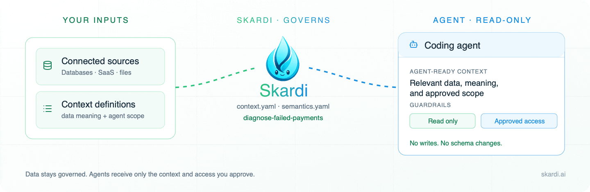

<div align="center">

<picture>
  <source media="(prefers-color-scheme: dark)" srcset="asset/controlled-db-debugging-hero-dark.gif">
  
</picture>

# Give coding agents the right data — safely.

**Skardi is an open-source governed data access layer for AI agents.**
Describe the data an agent may use, explain what it means, and expose only the queries you want it to run.

<p align="center">
  <a href="https://github.com/SkardiLabs/skardi" title="Star Skardi on GitHub"></a>&nbsp;·&nbsp;
  <a href="https://www.skardi.ai/" title="Visit skardi.ai"></a>&nbsp;·&nbsp;
  <a href="https://skardilabs.github.io/skardi-docs/" title="Read the Skardi documentation"></a>&nbsp;·&nbsp;
  <a href="https://discord.gg/S5YQQPEV2m" title="Join the Skardi Discord community"></a>
</p>

</div>

---

## See it work: diagnose a failed payment without changing data

A coding agent needs to answer: **why did Acme Robotics' payment fail after a checkout change?**

The runnable demo uses only fake SQLite data. It lets the agent inspect reviewed table meanings, returns the rows needed for the diagnosis, and rejects an `UPDATE` plus a `DROP TABLE` before the server starts.

```bash
git clone https://github.com/SkardiLabs/skardi.git
cd skardi
bash demo/controlled_db_debugging/verify.sh
```

The check builds the local binaries if needed, then produces:

```text
== 1. Agent-visible semantic context ==
table: payments  -- Payment attempts from the checkout service.
  processor_response: Utf8  -- Short diagnostic returned by the payment processor.

== 2. Unsafe operations are rejected before serving ==
Verified rejection: attempt_refund.yaml
Verified rejection: attempt_drop_table.yaml

== 3. Run the safe diagnostic endpoint ==
Verified safe diagnostic result: Acme Robotics failed after 3DS.
```

This is the full demo: [what it verifies and how it works](demo/controlled_db_debugging/README.md).

---

## Why Skardi?

Giving an agent a database connection is not enough. It still has to know which source matters, what a field means in the business, and what it must not change.

Without Skardi, teams often choose between two poor defaults: put a raw schema or data dump in the prompt, or give the agent a broad database credential. Both make mistakes easier.

With Skardi, you define three things in files that live with your code:

- **Context**: which data sources are available and whether each is read-only or explicitly writable.
- **Semantics**: plain-language descriptions of tables and columns, so `status` or `customer` has a reviewed meaning instead of a guessed one.
- **Pipelines**: named, parameterized tasks such as `diagnose-failed-payments`, exposed as REST endpoints for a shared agent workflow.

The agent can use the CLI for local exploration, or call a declared pipeline through HTTP. The same definitions are inspectable by the developer who owns the data.

**Flow:** your data → context YAML → semantics YAML → named pipeline → CLI or REST.

---

## Start with your own data

### 1. Install the tools

For the database path, install both the CLI and the HTTP server from a source checkout:

```bash
cargo install --locked --path crates/cli
cargo install --locked --path crates/server
```

Pre-built releases and installation alternatives are in the [installation docs](https://skardilabs.github.io/skardi-docs/).

### 2. Register only the source the task needs

```yaml
# ctx.yaml
kind: context
metadata:
  name: support-debugging
spec:
  data_sources:
    - name: orders
      type: postgres
      connection_string: "postgresql://localhost:5432/support"
      options:
        schema: public
        table: orders
        user_env: PG_USER
        pass_env: PG_PASSWORD
      # access_mode defaults to read_only
```

### 3. Add the business meaning a developer has reviewed

```yaml
# semantics.yaml
kind: semantics
metadata:
  name: support-debugging
spec:
  sources:
    - name: orders
      description: "One row per customer order. Cancelled orders are not completed orders."
      columns:
        - name: status
          description: "Lifecycle state of an order."
        - name: created_at
          description: "UTC timestamp when the order was created."
```

### 4. Turn a recurring task into a narrow interface

```yaml
# pipelines/order-status.yaml
kind: pipeline
metadata:
  name: order-status
spec:
  query: |
    SELECT status, COUNT(*) AS orders
    FROM orders
    WHERE created_at >= {from}
      AND created_at < {to}
    GROUP BY status
```

```bash
skardi-server --ctx ctx.yaml --semantics semantics.yaml --pipeline pipelines/ --port 8080

curl -X POST http://localhost:8080/order-status/execute \
  -H 'Content-Type: application/json' \
  -d '{"from":"2026-07-01","to":"2026-08-01"}'
```

The server runs the named pipeline rather than exposing a general SQL endpoint. A source is read-only unless you explicitly set `access_mode: read_write`; pipeline DDL is rejected while configuration loads. See [context boundaries for agents](docs/agent_data_plane.md) for the precise current behavior.

---

## Use Skardi from an agent

Any coding agent with a shell tool can call the CLI. For a local investigation, first let it read the reviewed schema and semantics:

```bash
skardi query --ctx ctx.yaml --semantics semantics.yaml --schema --all
```

Then it can run a scoped query:

```bash
skardi query --ctx ctx.yaml --sql "SELECT status, COUNT(*) FROM orders GROUP BY status"
```

For a shared or recurring task, use a pipeline instead. The server makes the pipeline available at `POST /:name/execute`, with parameters inferred from its SQL.

---

## Other ways to start

**Explore files and databases from the CLI.** Query local CSV, Parquet, JSON, SQLite, and registered database sources without running a server. Start with the [CLI guide](docs/cli.md).

**Build a local document knowledge base.** The [`auto_knowledge_base`](https://github.com/SkardiLabs/skardi-skills/tree/main/auto_knowledge_base) skill turns a folder of documents into a local, cited retrieval workflow. It is a separate onboarding path for local documents.

**Serve a small application backend.** A YAML pipeline becomes a parameterized REST endpoint without writing application glue. See [pipelines](docs/pipelines.md) and the [simple backend demo](demo/simple_backend/).

---

## Data sources and capabilities

Skardi can query and join data across:

- **Databases:** PostgreSQL, MySQL, SQLite, MongoDB, Redis, DynamoDB, SeekDB, and InfluxDB 3.
- **Files and lakehouses:** CSV, JSON / NDJSON, Parquet, Lance, Apache Iceberg, and files in S3, GCS, or Azure Blob Storage.
- **Document and retrieval workflows:** document parsing, full-text search, vector search, hybrid search, and embeddings.

See the [data-source guides](docs/) for runnable configuration examples. Skardi's engine is built on [Apache DataFusion](https://datafusion.apache.org/) and supports federated SQL when a task needs to join registered sources.

---

## Examples

- [Controlled database debugging](demo/controlled_db_debugging/) — investigate a failed payment with fake staging data; prove writes and DDL are rejected.
- [Simple backend](demo/simple_backend/) — expose a small SQLite backend as REST endpoints.
- [Agent-native wiki](demo/llm_wiki/) — hybrid retrieval, inline embeddings, and agent-facing verbs.
- [RAG](demo/rag/) — an end-to-end retrieval-augmented generation workflow.
- [Movie recommendation](demo/movie_recommendation/) — ONNX model inference in a query pipeline.

---

## Documentation

- [CLI guide](docs/cli.md)
- [Server and REST API](docs/server.md)
- [Pipeline format](docs/pipelines.md)
- [Semantics YAML](docs/semantics.md)
- [Context boundaries for agents](docs/agent_data_plane.md)
- [Federated queries](docs/federated-queries.md)

---

## Architecture

<details>
<summary>View the open-source architecture</summary>

<p align="center">
  
</p>

</details>

---

## Contributing and community

Skardi is being built in public. Open an [issue](https://github.com/SkardiLabs/skardi/issues), start a discussion in [Discord](https://discord.gg/S5YQQPEV2m), or send a pull request. For local development commands and contribution rules, see [AGENTS.md](AGENTS.md).

## License

[Apache 2.0](LICENSE)
