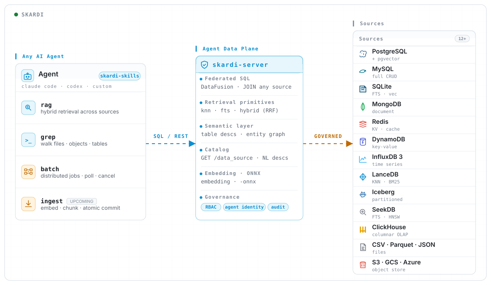

<div align="center">
<p align="center">


**Skardi is an open-source agent data plane** — parameterized SQL templates served as REST endpoints (and shell verbs) your agent calls as tools, turning *data autonomy* (letting the agent decide what to query and write) into a default you can govern.

**Federated** · one engine over every source &nbsp;·&nbsp; **Governed** · semantic overlay, lineage, branching &nbsp;·&nbsp; **Agent-native** · REST + shell + MCP-soon

<a href="https://skardilabs.github.io/skardi-docs/">Documentation</a> •
<a href="#roadmap">Roadmap</a> •
<a href="https://discord.gg/S5YQQPEV2m">Discord</a>

[License]: https://opensource.org/licenses/Apache-2.0
[License Badge]: https://img.shields.io/badge/License-Apache%202.0-orange.svg
[CI]: https://github.com/SkardiLabs/skardi/actions/workflows/ci.yml
[CI Badge]: https://github.com/SkardiLabs/skardi/actions/workflows/ci.yml/badge.svg
[Codecov]: https://codecov.io/gh/SkardiLabs/skardi
[Codecov Badge]: https://codecov.io/gh/SkardiLabs/skardi/branch/main/graph/badge.svg
[crates.io]: https://crates.io/crates/skardi
[crates.io Badge]: https://img.shields.io/crates/v/skardi?logo=rust
[Docs]: https://docs.rs/skardi
[Docs Badge]: https://docs.rs/skardi/badge.svg
[Discord]: https://discord.gg/S5YQQPEV2m
[Discord Badge]: https://img.shields.io/badge/Discord-Join-5865F2?logo=discord&logoColor=white

[![License Badge]][License]
[![CI Badge]][CI]
[![Codecov Badge]][Codecov]
[![crates.io Badge]][crates.io]
[![Docs Badge]][Docs]
[![Discord Badge]][Discord]

[](https://sealos.io/products/app-store/skardi/) [](https://github.com/SkardiLabs/skardi-skills)

</p>
</div>

<hr />

## Why Skardi?

**The most agent-friendly backend for builders shipping their first AI agent.** The painful part of agent-building isn't the prompt — it's the data plumbing: a vector DB to stand up, an embedding pipeline to maintain, a chunker to debug, a tool-call wrapper to write for every query. Skardi auto-bootstraps the primitives every agent needs so you ship in hours, not weeks:

- **[`auto_rag`](https://github.com/SkardiLabs/skardi-skills/tree/main/auto_rag) — Auto-RAG (Retrieval Augmented Generation).** Server-backed hybrid search (vector + full-text + RRF) via `skardi-server` over a datastore you already control (Postgres + pgvector, MongoDB, or Lance). The skill renders the config, starts the server, and drives ingestion and queries through REST. One command from a datastore to a working retrieval API your agent calls as a tool — no Python orchestration layer, no glue code.
- **[`auto_knowledge_base`](https://github.com/SkardiLabs/skardi-skills/tree/main/auto_knowledge_base) — Auto agent knowledge base.** Point it at a directory of documents and you have a queryable, citable local KB one command later. Chunking, embedding, indexing, and hybrid search are exposed to your agent as a `skardi grep` verb. Zero infra by default (SQLite + local embeddings), so any Claude Code / Cursor session gets a grounded knowledge base over your files.
- **Zero bootstrap** — `ctx.yaml`, pipelines, schema, server, all rendered for you by **[skardi-skills](https://github.com/SkardiLabs/skardi-skills)**. Install once and your agent has a working data tool the same hour.

You build the agent. Skardi handles the data plane.

---

## Get started in 60 seconds — install on Claude Code

Open any Claude Code session and run:

```text
/plugin marketplace add SkardiLabs/skardi-skills
/plugin install skardi-deploy-and-patterns@skardi-skills
/plugin install auto-knowledge-base@skardi-skills
/plugin install auto-rag@skardi-skills
```

That's it — the skills are now available across all your projects, and `/plugin marketplace update skardi-skills` pulls future versions. For Cursor and other [Agent Skills](https://agentskills.io/)-compatible tools, plus a manual-copy fallback, see the [skardi-skills README](https://github.com/SkardiLabs/skardi-skills#installation).

Curious why a uniform plane matters? Read on.

---

## ⭐️ Star the Repository

If **skardi-skills** lands well in your agentic stack — auto-RAG up in a minute, a knowledge base your agent actually grounds in — drop a ⭐️ on this repo. It helps other agent builders discover Skardi, makes onboarding their first agent that much shorter, and signals which directions are worth pushing on.

<p align="center">
  <a href="https://github.com/SkardiLabs/skardi">
    
  </a>
</p>

---

## What is an "agent data plane"?

Borrowing the phrase from cloud infra: your AI agent has two layers. The **control plane** is the reasoning loop — prompts, tool selection, your orchestration code. The **data plane** is where every byte of context comes from and goes to: vector DB hits, SQL queries, file reads, writes back, audit trails.

Skardi is a uniform plane for that data layer. A single open-source server (and CLI) that exposes your data — Postgres, SQLite, MongoDB, S3 files, data lakes, vector stores — as parameterized SQL pipelines declared in YAML. Each pipeline is callable as both a REST endpoint and a `skardi` shell verb, so the same definition works in Claude Code, Cursor, your own agent loop, or any HTTP-aware host. One JOIN can span every registered source. Latency typically sits in tens of milliseconds, dominated by your data source's own.

```yaml
# pipelines/wiki-search-hybrid.yaml — your agent's hybrid-search tool, declared once
kind: pipeline
metadata: { name: wiki-search-hybrid }
spec:
  query: |
    SELECT slug, title FROM sqlite_knn('wiki', candle('bge-small', {query}), {limit})
    -- (full vector + FTS + RRF version in Quick Start below)
```

```bash
$ skardi grep "turing machines" --limit=10                # shell tool, any Bash-tool agent
$ curl -X POST :8080/wiki-search-hybrid/execute -d '{...}' # same pipeline, served as REST
```

That uniformity is also what makes the *durable* reason to put a plane in front possible: **governance**. Once every read and write goes through one engine, three primitives compose on top of it instead of fragmenting across N SDKs:

1. **Semantic overlay.** Plain-English descriptions of every table, column, and pipeline, served on `GET /data_source` as the agent's discovery surface. The agent reads *what each table is for* before querying, instead of guessing from a schema dump. Reading agents already cash this win — the catalog endpoint *is* the agent's prompt. ([docs/semantics.md](docs/semantics.md), shipped today)
2. **Lineage.** Every write tagged with `agent_id`, `session_id`, `tool_call_id`, and `timestamp`, queryable from metadata. The async-job ledger already records every batch write today (parameters, status, run id); inline-write lineage on the synchronous path is in progress — see [Roadmap](#roadmap).
3. **Snapshot-as-branch.** Iceberg / Lance-backed branches with `git checkout`-like semantics — an agent writes into a branch, you review, you merge or roll back. If the agent updated 1,000 rows you don't like, undoing it is one call, not an incident. (in progress — see [Roadmap](#roadmap))

Without these, "let the agent touch the database" is reckless and the right answer is "don't"; with them, *data autonomy* — letting the agent decide what to query and write — becomes a default you can actually grant. Federation, declarative SQL pipelines, REST + shell bindings — those are how the plane is built. Governance is what the plane is *for*.

For the longer technical read — each primitive's shipped vs. in-progress status, the run-ledger schema, the chokepoint argument unpacked — see [docs/agent_data_plane.md](docs/agent_data_plane.md).

```text
   your agent  ──▶  skardi  ──┬─▶  Postgres / MySQL / SQLite / MongoDB / Redis
   (Claude / GPT /     │              ├─▶  S3 / GCS / Azure (CSV, Parquet, Lance)
    Cursor / your      │              ├─▶  Apache Iceberg, Lance datasets
    own loop)          │              └─▶  pgvector, sqlite-vec, Lance KNN, SeekDB HNSW
                       │
                  parameterized SQL  ──▶  one JOIN can span all of the above
                  (YAML pipelines)
```

- **`skardi` CLI** — run federated SQL or any pipeline directly from a shell. Drop it into Claude Code, Cursor, or any agent with a Bash tool and it's wired with no MCP config.
- **`skardi-server`** — same engine over HTTP, with two surfaces: **online serving** (a YAML pipeline becomes a parameterized REST endpoint with an inferred request/response schema) and **offline jobs** (async batch writes into Lance or any read-write DB; if a job fails halfway you don't get a corrupted dataset, and every run is logged in a SQLite ledger you can list and inspect).
- **Skardi-server is stateful but lightweight** — a single Rust process, plus a small SQLite file for the run ledger and (optional) auth. One server can serve many agents; deploy it next to your data, behind your usual auth.

> **Beta.** Skardi is under active development. APIs may move. Hit us on [Discord](https://discord.gg/S5YQQPEV2m) if you want to co-design a POC.

<p align="center">
  <a href="https://htmlpreview.github.io/?https://github.com/SkardiLabs/skardi/blob/main/asset/architecture-open-source.html">
    <picture>
      
    </picture>
  </a>
  <br>
  <sub><a href="https://htmlpreview.github.io/?https://github.com/SkardiLabs/skardi/blob/main/asset/architecture-open-source.html">View interactive diagram →</a></sub>
</p>

---

## When does a uniform data plane earn its keep?

Direct SDKs work fine for a single read-only RAG bot — you can wire one to Postgres + a vector DB and ship in an afternoon. The plane earns its keep cumulatively: every property below is true on day one for the simplest agent, and the last three become load-bearing once the agent starts writing, you add a second agent, or "what did the agent do yesterday?" stops being a rhetorical question.

1. **Discovery — the agent reads what data *means*, not just shapes.** A semantic overlay attaches plain-English descriptions to every table, column, and pipeline; the catalog endpoint serves them so the agent picks the right verb before querying instead of guessing from a schema dump. (shipped — [docs/semantics.md](docs/semantics.md))
2. **Federation — one JOIN over every source.** Federated SQL across Postgres / SQLite / MongoDB / S3 / Iceberg / Lance / vector stores, so the agent's "give me X about Y" doesn't need application-side joins.
3. **Bindings — one pipeline, every host.** The same YAML serves as REST endpoint, `skardi` shell verb, and (soon) MCP tool — works in Claude Code, Cursor, your own loop, or a hosted agent with no extra glue.
4. **Audit — one trail across every write.** Every write tagged with `agent_id` / `session_id` / `tool_call_id` / `timestamp`, queryable from one place. With direct SDKs you get distributed log files; through a plane you get one ledger. (the existing async-job ledger already records every batch write today; inline-write lineage in progress)
5. **Rollback — branch the data, not your incident channel.** Iceberg / Lance-backed branches with `git checkout`-like semantics: agent writes into a branch, you review, you merge or revert. With direct DB writes a bad agent run is an incident; through the plane it's one call. (in progress)

If your agent only ever reads from one source, direct SDKs are simpler. If it reads from many, or writes back, or you want to govern what it does — the plane is what makes data autonomy a responsible default rather than a gamble.

Full breakdown of the three primitives — semantic-overlay YAML, the verbatim run-ledger schema, and why each primitive requires a chokepoint — in [docs/agent_data_plane.md](docs/agent_data_plane.md).

---

## Quick Start

Turn a pile of documents into a knowledge base your agent can search. **You only do 3 things** — the agent does the rest.

### 1 — Install the CLI (pick one)

```bash
# Option A · pre-built binary (faster, no Rust needed)
curl -fSL "https://github.com/SkardiLabs/skardi/releases/latest/download/skardi-$(uname -m | sed 's/arm64/aarch64/')-$(uname -s | sed 's/Linux/unknown-linux-gnu/' | sed 's/Darwin/apple-darwin/').tar.gz" | tar xz && sudo mv skardi /usr/local/bin/

# Option B · from source (recommended during beta; needs Rust first)
git clone https://github.com/SkardiLabs/skardi.git && cd skardi && cargo install --locked --path crates/cli
```

You should see `skardi --version` print `0.4.0` or higher.

### 2 — Install the skill in Claude Code (two lines)

```
/plugin marketplace add SkardiLabs/skardi-skills
/plugin install auto-knowledge-base@skardi-skills
```

(Cursor / manual: copy the skill directory into `~/.claude/skills/`.)

### 3 — Talk to the agent in plain language (no need to say "vectors" or "RAG")

> "Turn `./docs` into a knowledge base I can search, then find 'how is X implemented'."

From here **the agent runs the whole thing itself** — downloads the model, chunks, builds the index, retrieves — and answers **grounded in the matched passages, with sources**.

### Did it really work? (4 checks — "no errors" is not enough)

- [ ] `kb.db` exists and it prints `[6/6] Workspace ready`
- [ ] `rows` ≥ number of documents, `files` = number of documents (every file made it in)
- [ ] Ask something the docs clearly cover — the **first result actually matches** (not a random line)
- [ ] The agent's answer can point to which document it came from

All four pass = the knowledge base really works.

### What you get

- ⏱️ **Under 15 minutes**: your agent retrieves from your docs / databases and answers **with sources**
- 🔗 **One SQL across many sources**: Postgres / MySQL / SQLite / MongoDB / Redis / S3 / Iceberg / Lance / vector stores
- 🧩 **Zero infrastructure to start**: install skardi and go — no server, no signup, no payment, all on your machine
- 🔒 **You own permissions**: sources are read-only by default; writing requires you to opt in explicitly — the bottom line for handing data to an agent

**Versus other self-hosted KB / RAG stacks, three things they typically can't do, or make you assemble yourself:**

- **Live cross-source JOIN**: other stacks must first "ingest" data into their own store, then query; Skardi runs one SQL directly across live sources
- **Define once = CLI verb + REST endpoint**: the same YAML works in both places, zero MCP config to plug into Claude Code / Cursor; others give you an API only, or a framework you must wire into a service yourself
- **Write-facing governance**: read-only by default + dangerous-op (DDL) blocking + write lineage (rollback in progress); others mostly do "query auditing" only, or let you write by default

### Troubleshooting (symptom → fix)

| Symptom | Cause | Fix |
|---|---|---|
| Init fails with `AttributeError …'enable_load_extension'` | Using macOS system Python | `brew install python`, re-run with `/opt/homebrew/bin/python3` |
| `skardi: command not found` | Not installed / not on PATH | Re-read "Install the CLI"; confirm `skardi --version` |
| Ingest fails with `Invalid function 'chunk'` | skardi version below 0.4.0 | Upgrade to 0.4.0+ (`chunk()` is a hard dependency) |
| Ingest fails with `UNIQUE constraint failed` | Same batch ingested twice | Normal protection; to rebuild, re-init with `--force` |
| Retrieval returns empty | Empty index / keyword too obscure | Confirm ingest `rows > 0` first; reword closer to the docs' wording, or use pure semantic search |
| Retrieval results irrelevant | Embedding model doesn't match corpus language / domain | Switch model (multilingual e5, code voyage-code), then rebuild the index |

### Connect your own database (optional — only when wiring in your own DB)

This is an advanced step. Skip it if you're just indexing local files — the 3 steps above already gave you a working knowledge base.

**(1) You do this** (only you can — the agent can't): write a `ctx.yaml` that names each source, fills in connection + credentials, and sets permissions:

```yaml
data_sources:
  - name: products          # the name you'll use in SQL later
    type: csv
    path: ./data/products.csv
  - name: warehouse
    type: postgres
    connection_string: "postgresql://localhost:5432/warehouse"   # you fill in credentials
# All sources are read-only by default; to let the agent write,
# opt in explicitly on that source:
#   access_mode: read_write
```

**(2) You do this**: have the agent (or you) query against that config:

```bash
skardi query --ctx ./ctx.yaml --sql "SELECT * FROM products LIMIT 10"
```

You should see your database's data come back (a result table); one SQL can JOIN across every source above.

**Key (the safety line)**: which sources, and read vs. write, is yours alone to decide. Read-only by default; writing requires an explicit `access_mode: read_write`.

---

## Worked examples

For end-to-end walkthroughs — RAG, recommendations, an agent-native wiki, a simple REST backend — see the [`demo/`](demo/) directory. Each demo ships as a self-contained `ctx.yaml` plus pipelines (and sometimes jobs), so reading the YAML shows the Skardi shape in practice. Full list in [Demo & Examples](#demo--examples) below.

---

## Supported Data Sources

| Type | CRUD | Catalog mode | Description | Docs |
|------|------|--------------|-------------|------|
| PostgreSQL | Full | Yes | Table or catalog registration, pgvector KNN | [docs/postgres/](docs/postgres/) |
| MySQL | Full | Yes | Table or catalog registration | [docs/mysql/](docs/mysql/) |
| SQLite | Full | Yes | Table or catalog registration, sqlite-vec KNN, FTS | [docs/sqlite/](docs/sqlite/) |
| MongoDB | Full | No | Collections with point lookups | [docs/mongo/](docs/mongo/) |
| Redis | Full | No | Hashes mapped to SQL rows | [docs/redis/](docs/redis/) |
| DynamoDB | Full | Yes | Items mapped to SQL rows, table or catalog registration, scan + filter pushdown | [docs/dynamodb/](docs/dynamodb/) |
| SeekDB | Full | Yes | MySQL-wire CRUD, native FULLTEXT FTS, HNSW VECTOR KNN | [docs/seekdb/](docs/seekdb/) |
| Lance | Read (job-write) | No | KNN vector search, BM25 FTS; job destination | [docs/lance/](docs/lance/) |
| CSV | Read | No | Local or remote CSV files | [docs/server.md](docs/server.md) |
| Parquet | Read | No | Local or remote Parquet files | [docs/server.md](docs/server.md) |
| JSON / NDJSON | Read | No | Local or remote JSON files | [docs/cli.md](docs/cli.md) |
| S3 / GCS / Azure | Read | No | CSV, Parquet, Lance from object stores | [docs/S3_USAGE.md](docs/S3_USAGE.md) |
| Apache Iceberg | Read | No | Schema evolution, partition pruning | [docs/iceberg/](docs/iceberg/) |
| InfluxDB 3 | Read | No | Time-series measurements over Arrow Flight SQL | [docs/influxdb/](docs/influxdb/) |
| Documents | Read | No | PDF/Office/ODF/image -> per-page markdown, tables, images (local directories; `documents` feature) | [docs/documents.md](docs/documents.md) |

---

## Additional Features

- **Federated queries** — JOIN across different source types in one SQL query (CSV vs Postgres vs Lance, etc). See [docs/federated-queries.md](docs/federated-queries.md).
- **Table descriptions for agents** — write natural-language descriptions of each table and column in YAML; Skardi serves them on `GET /data_source` so the agent can read what each table is for before it queries. See [docs/semantics.md](docs/semantics.md).
- **Authentication** — session-based via better-auth + SQLite. See [docs/auth/](docs/auth/).
- **ONNX inference** — inline model predictions in SQL via an `onnx_predict` UDF. See [docs/onnx_predict.md](docs/onnx_predict.md).
- **Embedding inference** — call embedding models from inside SQL via the `candle()` UDF (local GGUF / Candle models, or remote OpenAI-style APIs). See [docs/embeddings/](docs/embeddings/).
- **Observability** — OpenTelemetry traces / metrics / logs with a pre-configured Grafana stack. See [docs/observability.md](docs/observability.md).

---

## Architecture

<details>
<summary>Click to expand Skardi's architecture diagram</summary>

<p align="center">
  
</p>

</details>

---

## Docker

```bash
# Build
docker build -t skardi .
docker build -t skardi --build-arg FEATURES=rag .   # adds embedding + chunk UDFs

# Or pull pre-built
docker pull ghcr.io/skardilabs/skardi/skardi-server:latest
docker pull ghcr.io/skardilabs/skardi/skardi-server-rag:latest   # embedding + chunk UDFs

# Run
docker run --rm \
  -v /path/to/your/ctx.yaml:/config/ctx.yaml \
  -v /path/to/your/pipelines:/config/pipelines \
  -p 8080:8080 \
  skardi \
  --ctx /config/ctx.yaml \
  --pipeline /config/pipelines \
  --port 8080
```

## Cloud (Sealos)

The fastest cloud path is the [Sealos](https://sealos.io) template in **[skardi-skills](https://github.com/SkardiLabs/skardi-skills)** — our growing library of ready-to-use Skardi setups. One-click launch, no local setup.

## Building from Source

```bash
git clone https://github.com/SkardiLabs/skardi.git
cd skardi

cargo build --release -p skardi-cli
cargo build --release -p skardi-server

# With the full RAG kit (embedding UDFs + chunk UDF)
cargo build --release -p skardi-server --features rag

# Or just the embedding UDFs (ONNX, GGUF, Candle, remote embed) without chunking
cargo build --release -p skardi-server --features embedding
```

---

## Demo & Examples

| Directory | Description |
|-----------|-------------|
| [demo/llm_wiki/](demo/llm_wiki/) | Agent-native wiki (server + CLI flavors) — hybrid search, inline embeddings, agent verbs |
| [demo/simple_backend/](demo/simple_backend/) | REST backend with SQLite and optional auth |
| [demo/rag/](demo/rag/) | Retrieval-augmented generation pipeline |
| [demo/movie_recommendation/](demo/movie_recommendation/) | Movie recommendations with ONNX NCF model |

For data-source-specific demos, see the entries in [Supported Data Sources](#supported-data-sources).

---

## Roadmap

**Coming soon (not yet shipped)**: a skills generator that emits Claude Code skill files per pipeline, an MCP binding for non-Claude hosts, a first-class memory primitive (one YAML block giving an agent a memory store with keyword + semantic recall, automatic expiration, and per-session provenance), lineage capture, and snapshot-as-branch checkpoints (roll back a destructive agent write — e.g. an agent that updated 1,000 rows you don't like — in one call).

We're **building in public**. `[x]` means shipped today, `[ ]` means open for contribution. Open an issue or hop into [Discord](https://discord.gg/S5YQQPEV2m) on anything unchecked.

`1` Federated SQL engine
   - [x] One SQL engine ([DataFusion](https://datafusion.apache.org/), in-process) over CSV, Parquet, JSON, S3 / GCS / Azure, Postgres, MySQL, SQLite, MongoDB, Redis, Iceberg, Lance, SeekDB — all joinable in one query
   - [x] Register either one specific table, or point Skardi at a database (Postgres / MySQL / SQLite) and let it auto-discover all tables — one config line either way
   - [ ] Graph database sources (Neo4j / Kuzu) — to unlock graphRAG patterns alongside vector / full-text retrieval

`2` Retrieval primitives
   - [x] Vector search (KNN) — `pg_knn` (pgvector), `sqlite_knn` (sqlite-vec), Lance KNN, SeekDB HNSW
   - [x] Full-text search (FTS) — `pg_fts`, `sqlite_fts`, Lance BM25 inverted indexes, SeekDB FULLTEXT
   - [x] Hybrid search — combine keyword and semantic search results in one SQL query (RRF merge), no Python re-ranking layer
   - [x] Inline embeddings — `candle()` UDF (local GGUF / Candle models, or remote embedding APIs) called inside SQL, so content + vector stay on the same row atomically
   - [x] ONNX inference — `onnx_predict` UDF for inline model predictions in SQL
   - [x] Chunking UDF — `chunk()` with character / markdown splitters (via [`text-splitter`](https://crates.io/crates/text-splitter)) so ingestion can chunk inline in SQL ([docs](docs/chunk.md)); token / code splitters next
   - [ ] Memory primitive — give your agent a memory store (keyword + semantic recall, TTL/expiration, per-session provenance) defined in one YAML block

`3` Online serving (pipelines)
   - [x] Declarative YAML → parameterized REST endpoint with inferred request / response schema
   - [x] Built-in pipeline dashboard
   - [x] CLI pipeline binding + aliases — `skardi run <pipeline> --param=…` and user-defined verb aliases ([#90](https://github.com/SkardiLabs/skardi/pull/90))
   - [x] CLI federated SQL — `skardi query` against files, object stores, datalake formats, and databases with no server required

`4` Offline jobs
   - [x] Async batch execution with submit / poll / cancel ([#98](https://github.com/SkardiLabs/skardi/pull/98))
   - [x] Lance dataset destinations with atomic commit + crash recovery
   - [x] SQL-DML destinations (Postgres / MySQL / SQLite)
   - [x] SQLite-backed run ledger with submit-time schema diff

`5` Agent-facing bindings
   - [x] REST — every pipeline served as a parameterized HTTP endpoint
   - [x] Shell — every pipeline runnable as a `skardi` command; works in Claude Code, Cursor, and any agent with a Bash tool
   - [ ] Skills generator — `skardi skills generate --ctx <ctx.yaml> --out .claude/skills/` emits a skill Markdown per pipeline for Claude Code / Desktop auto-discovery
   - [ ] MCP binding — same pipeline YAML projected to MCP tools for non-Claude hosts

`6` Governance & lineage
   - [x] Plain-English table descriptions — a `kind: semantics` YAML overlay attaching natural-language descriptions to tables / columns (supports both bare source names and fully-qualified `catalog.schema.table` paths); served on `GET /data_source` so agents can discover what each table is for before querying
   - [ ] Agent-callable `describe` verb — CLI / pipeline form on top of the discovery endpoint
   - [ ] Lineage capture — `agent_id`, `session_id`, `tool_call_id`, `timestamp` on writes; queryable from metadata tables
   - [ ] Agent identity passthrough — any binding injects client identity into a SQL context var pipelines can read
   - [ ] Snapshot-as-branch / agent checkpoints — Iceberg / Lance-backed `git checkout`-like semantics: if your agent updates 1,000 rows and you don't like the result, roll back in one call

`7` Ops
   - [x] Session auth — drop-in user auth via [better-auth](https://www.better-auth.com/) backed by SQLite
   - [x] Observability — OpenTelemetry traces / metrics / logs with a pre-configured Grafana stack
   - [x] Docker + pre-built binaries — Linux x86_64 / ARM64, macOS ARM64

---

## Community

Building an agent on top of Skardi, or want to influence the roadmap above? Join us on [Discord](https://discord.gg/S5YQQPEV2m), file an issue, or open a PR. We read everything.

## License

Apache 2.0 — see [LICENSE](LICENSE).
