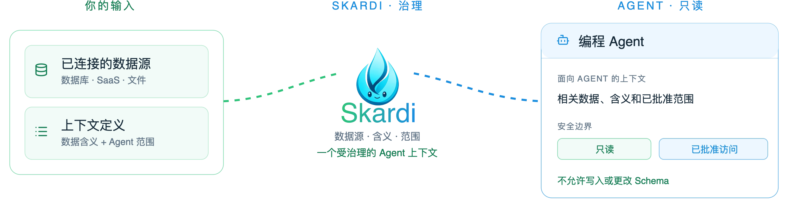

<div align="center">

<picture>
  <source media="(prefers-color-scheme: dark)" srcset="asset/controlled-db-debugging-hero-zh-CN-dark.png">
  
</picture>

<br>

<p align="center">
  <strong>给 Skardi 点星 ❤️ →</strong>&nbsp;
  <a href="https://github.com/SkardiLabs/skardi" title="在 GitHub 上 Star Skardi"></a>&nbsp;·&nbsp;
  <a href="https://www.skardi.ai/" title="访问 skardi.ai"></a>&nbsp;·&nbsp;
  <a href="https://skardilabs.github.io/skardi-docs/docs/intro" title="阅读 Skardi 文档"></a>&nbsp;·&nbsp;
  <a href="https://discord.gg/S5YQQPEV2m" title="加入 Skardi Discord 社区"></a>
</p>

# 让编程 Agent 获得可信且可自我改进的上下文。

**Skardi 将你批准使用的数据转化为供编程 Agent 使用的受治理上下文。** 定义 Agent 可以使用哪些数据源，解释每张表和字段的业务含义，并只暴露它完成任务所需的只读查询或 pipeline——让 Agent 无需获得宽泛的数据库权限，也能基于可信上下文完成工作。

<p align="center">
  <a href="https://github.com/SkardiLabs/skardi/stargazers"></a>
  <a href="https://github.com/SkardiLabs/skardi/actions/workflows/ci.yml"></a>
  <a href="https://crates.io/crates/skardi"></a>
  <a href="LICENSE"></a>
  <a href="https://discord.gg/S5YQQPEV2m"></a>
</p>

<p align="center"><a href="README.md">English</a>&nbsp;·&nbsp;<strong>简体中文</strong></p>

</div>

---

## 快速上手

克隆 Skardi，用仓库已内置的示例数据启动一个 server，再从 CLI 对它执行一次只读查询。

Skardi 有两个可执行文件，这个分工很关键：`skardi-server` 持有查询引擎和已注册的数据源，`skardi` 则是一个精简的 HTTP 客户端，每条命令都发给正在运行的 server。CLI 自身没有引擎，所以先起 server。

下面这些步骤都不需要编译：server 以容器镜像的形式发布，CLI 是预编译好的二进制文件。

### 1. 克隆仓库

`data/products.csv` 和注册它的 context 文件都在仓库里，无需另行准备数据：

```bash
git clone https://github.com/SkardiLabs/skardi.git
cd skardi
```

### 2. 用内置示例启动 server

`-v "$PWD":/w:ro` 把你刚克隆的仓库以只读方式挂进容器，`-w /w` 让命令里的相对路径能对应上：

```bash
docker run -d --name skardi -p 8080:8080 \
  -v "$PWD":/w:ro -w /w \
  ghcr.io/skardilabs/skardi/skardi-server:latest \
  --ctx docs/basic/ctx.yaml --port 8080
```

### 3. 从 CLI 查询

下载对应平台的 CLI，指向刚启动的 server：

```bash
curl -sL https://github.com/SkardiLabs/skardi/releases/latest/download/skardi-aarch64-apple-darwin.tar.gz | tar xz
./skardi --server http://127.0.0.1:8080 query -e "SELECT * FROM products LIMIT 5" --table
```

预编译 CLI 覆盖 Apple 芯片的 macOS（`skardi-aarch64-apple-darwin`）、Linux x86_64（`skardi-x86_64-unknown-linux-gnu`）和 Linux arm64（`skardi-aarch64-unknown-linux-gnu`），都在[最新 release](https://github.com/SkardiLabs/skardi/releases/latest) 里。如果你在 macOS 上用浏览器下载，运行前先清掉隔离标记：`xattr -d com.apple.quarantine skardi`。

你会看到 `data/products.csv` 的前五行。`products` 是 `docs/basic/ctx.yaml` 里声明的数据源名——CLI 只能访问 server 已注册的表。

**想从源码构建，或者你的平台没有预编译版本？** 你需要一套 Rust 工具链，server 编译要几分钟：

```bash
cargo install --locked --path crates/server
cargo install --locked --path crates/cli
```

嵌入功能和其他安装方式见[安装文档](https://skardilabs.github.io/skardi-docs/)。

---

## 按你的目标继续

快速上手只验证了 server 和 CLI 之间已经打通。接下来按你想完成的结果选择路径，并把对应提示词直接发给编程 Agent。Agent 会先检查当前工作区，以最小且安全的方式落地，再说明它验证了什么；只有需要更多控制时才查阅链接的文档。

### 01 — 查询本地文件或数据源

适合查看 CSV、Parquet、数据库或对象存储中的数据，且不改动原始数据。

**直接发给你的编程 Agent：**

```text
帮我用 Skardi 查询本地文件或数据源。先检查当前工作区中的候选文件和已有 Skardi 配置；如果目标不明确，先问我需要查询哪个文件或数据源。所有数据源保持只读，凭据通过环境变量保留，不修改数据或 Schema。只创建必要的最小配置，用它启动 Skardi server——如果本机没装 `skardi-server`，就用 `ghcr.io/skardilabs/skardi/skardi-server` 容器镜像——然后通过 CLI 对这个 server 执行一次 schema 检查和一条有用的查询，最后说明创建了哪些文件、运行了什么命令，以及查询结果。
```

需要更多控制时，再看 [CLI 指南](docs/cli.md) 和[数据源指南](docs/)。

### 02 — 用 Agent 处理本地文档

适合将一个文档文件夹变成本地知识库，让 Agent 可以检索并给出可追溯的引用。

**直接发给你的编程 Agent：**

```text
用 Skardi 为当前工作区中的文档建立一个本地、可追溯引用的知识库。先阅读 auto_knowledge_base skill：https://github.com/SkardiLabs/skardi-skills/tree/main/auto_knowledge_base。识别要处理的文档文件夹；如果不明确，继续前先问我。除非文档类型或环境有特殊要求，否则采用 skill 的本地默认方案。知识库工作区必须与我的源文档分开；完成后用一次检索查询验证，并说明工作区位置、运行过的命令和带引用的结果。
```

完整的配置和排错细节见 [`auto_knowledge_base`](https://github.com/SkardiLabs/skardi-skills/tree/main/auto_knowledge_base) skill。

### 03 — 提供小型应用后端

适合把一个已审核的任务变成参数化 REST endpoint，既不用另写应用胶水代码，也不用把任意 SQL 留作应用的对外接口。

**直接发给你的编程 Agent：**

```text
在当前工作区中，为一个具体应用任务创建最小且安全的 Skardi HTTP 后端。先检查现有数据和配置；如果任务、数据源或需要返回的结果不明确，先问我再生成文件。创建只读的 context 和 semantics 定义，并为该任务添加一份只含 SELECT 的 YAML pipeline。不要添加把任意 SQL 当参数的 pipeline，不写入数据，也不修改 Schema。启动 Skardi server——如果本机没装 `skardi-server`，就用 `ghcr.io/skardilabs/skardi/skardi-server` 容器镜像——用一次请求验证 pipeline endpoint，最后说明配置文件、endpoint、请求和响应。
```

可运行的参考见 [pipelines](docs/pipelines.md) 和[简单后端 demo](demo/simple_backend/)。

---

## 连接你自己的数据

当你需要具名数据库数据源或共享的 Agent endpoint 时，再将一份小而可审查的数据约定放进代码库。

### 1. 只注册当前任务需要的数据源

```yaml
# ctx.yaml
kind: context
metadata:
  name: support-debugging
spec:
  data_sources:
    - name: orders
      type: postgres
      connection_string: "postgresql://localhost:5432/support"
      options:
        schema: public
        table: orders
        user_env: PG_USER
        pass_env: PG_PASSWORD
      # access_mode defaults to read_only
```

### 2. 写下开发者已审核的业务含义

```yaml
# semantics.yaml
kind: semantics
metadata:
  name: support-debugging
spec:
  sources:
    - name: orders
      description: "One row per customer order. Cancelled orders are not completed orders."
      columns:
        - name: status
          description: "Lifecycle state of an order."
        - name: created_at
          description: "UTC timestamp when the order was created."
```

### 3. 将重复任务收敛成窄接口

```yaml
# pipelines/order-status.yaml
kind: pipeline
metadata:
  name: order-status
spec:
  query: |
    SELECT status, COUNT(*) AS orders
    FROM orders
    WHERE created_at >= {from}
      AND created_at < {to}
    GROUP BY status
```

```bash
docker run -d --name skardi -p 8080:8080 \
  -v "$PWD":/w:ro -w /w \
  -e PG_USER -e PG_PASSWORD \
  ghcr.io/skardilabs/skardi/skardi-server:latest \
  --ctx ctx.yaml --semantics semantics.yaml --pipeline pipelines/ --port 8080

curl -X POST http://localhost:8080/order-status/execute \
  -H 'Content-Type: application/json' \
  -d '{"from":"2026-07-01","to":"2026-08-01"}'
```

`-e PG_USER -e PG_PASSWORD` 把 `ctx.yaml` 里点名的这两个环境变量传进容器，而不用把它们的值写在命令行上。有一点要注意：跑在你自己机器上的数据库，在容器内部并不是 `localhost`。把 server 放进数据库所在的同一个 Docker 网络，或者干脆用本机方式运行它（`cargo install --locked --path crates/server`，再用同样的参数启动 `skardi-server`）。

具名 pipeline 是你交给共享调用方的接口：SQL 事先经过审核，对外只开放参数。Server 也提供一个用于探索的临时 SQL endpoint `POST /query`，但它同样受这份 context 约束——只能访问已注册的数据源，始终拒绝 DDL 和 `COPY`，只有你显式配成 `access_mode: read_write` 的数据源才允许写入。除非你明确设置该项，否则数据源均为只读；配置加载时会拒绝 pipeline 中的 DDL。

通过 HTTP 调用 `/query` 的 Agent 可以附带一个 `ai_context` 对象——一个 `purpose` 和一个把同一次会话的查询归到一起的 `session_id`——它只被记录，不会被执行。（CLI 目前还没有对应的参数，所以这是 HTTP 调用方才有的能力。）在你这一侧，查询语句和其中的字面值默认不会进入日志和 OTLP 数据流，因此写在 SQL 里的密钥或客户姓名不会被送到你配置的采集系统；`--query-audit-db <路径>` 可以开启一份持久、可查询的 SQLite 审计记录。精确的当前行为见[面向 Agent 的 context 边界](docs/agent_data_plane.md)和 [server 参考文档](docs/server.md)。

---

## 从 Agent 中使用 Skardi

任何带有 shell 工具的编程 Agent 都可以调用 CLI。只需一次性告诉它 server 地址——`--server <URL>`、环境变量 `SKARDI_SERVER_URL`，或 `~/.skardi/config.yaml` 里的 `server:`，默认是 `http://127.0.0.1:8080`——之后每条命令都会发给这个 server。

排查问题时，先让它读取已审核的 schema 和 semantics：

```bash
skardi schema
```

然后执行范围受控的查询：

```bash
skardi query -e "SELECT status, COUNT(*) FROM orders GROUP BY status"
```

对于共享或重复发生的任务，请使用 pipeline。Server 会将它暴露为 `POST /:name/execute`，参数由其中的 SQL 推导。

---

## 数据源与能力

Skardi 可以跨以下数据查询和 join：

- **数据库：**PostgreSQL、MySQL、SQLite、MongoDB、Redis、DynamoDB、SeekDB 和 InfluxDB 3。
- **文件和湖仓：**CSV、JSON / NDJSON、Parquet、Lance、Apache Iceberg，以及位于 S3、GCS 或 Azure Blob Storage 的文件。
- **SaaS 工作空间：**GitHub、Slack、Notion 和飞书，通过你自己部署的 [Open Connector](https://github.com/oomol-lab/open-connector) 网关接入，凭据由网关持有——token 不会进入 Skardi，选定的资源会变成普通的 SQL 表，可以和其他数据源一起 join。见 [Open Connector 指南](docs/open-connector.md)。
- **文档与检索工作流：**文档解析、全文搜索、向量搜索、混合搜索和 embeddings。

可运行的配置示例见[数据源指南](docs/)。Skardi 的引擎构建于 [Apache DataFusion](https://datafusion.apache.org/)，当任务需要 join 已注册的数据源时，支持 federated SQL。

---

## 示例

- [简单后端](demo/simple_backend/) —— 将一个小型 SQLite 后端暴露为 REST endpoints。
- [Agent 原生 wiki](demo/llm_wiki/) —— 混合检索、内联 embeddings 和面向 Agent 的动词。
- [RAG](demo/rag/) —— 端到端的检索增强生成工作流。
- [电影推荐](demo/movie_recommendation/) —— 在查询 pipeline 中运行 ONNX 模型推理。

---

## 文档

- [CLI guide](docs/cli.md)
- [Server 和 REST API](docs/server.md)
- [Pipeline 格式](docs/pipelines.md)
- [Semantics YAML](docs/semantics.md)
- [面向 Agent 的 context 边界](docs/agent_data_plane.md)
- [Federated queries](docs/federated-queries.md)

---

## 架构

<details>
<summary>查看开源架构</summary>

<p align="center">
  <picture>
    <source media="(prefers-color-scheme: dark)" srcset="asset/architecture-open-source.svg">
    
  </picture>
</p>

</details>

---

## 贡献与社区

Skardi 正在公开构建。欢迎提交 [issue](https://github.com/SkardiLabs/skardi/issues)、在 [Discord](https://discord.gg/S5YQQPEV2m) 发起讨论，或发送 pull request。本地开发命令和贡献规则见 [AGENTS.md](AGENTS.md)。

## 许可证

[Apache 2.0](LICENSE)
