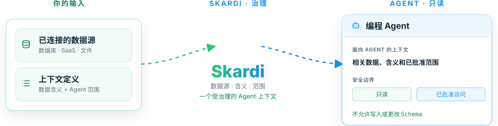

<div align="center">

<picture>
  <source media="(prefers-color-scheme: dark)" srcset="asset/controlled-db-debugging-hero-zh-CN-dark.svg">
  
</picture>

<br>

<p align="center">
  <strong>给 Skardi 点星 ❤️ →</strong>&nbsp;
  <ruby><a href="https://github.com/SkardiLabs/skardi" title="在 GitHub 上 Star Skardi"></a></ruby>&nbsp;·&nbsp;
  <ruby><a href="https://www.skardi.ai/" title="访问 skardi.ai"></a></ruby>&nbsp;·&nbsp;
  <ruby><a href="https://skardilabs.github.io/skardi-docs/" title="阅读 Skardi 文档"></a></ruby>&nbsp;·&nbsp;
  <ruby><a href="https://discord.gg/S5YQQPEV2m" title="加入 Skardi Discord 社区"></a></ruby>
</p>

# 让编程 Agent 安全地获得正确的数据。

**Skardi 是面向 AI Agent 的开源、受治理数据访问层。**
定义 Agent 可以使用哪些数据，解释数据的业务含义，并只暴露你希望它执行的查询。

<p align="center">
  <a href="https://github.com/SkardiLabs/skardi/stargazers"></a>
  <a href="https://github.com/SkardiLabs/skardi/actions/workflows/ci.yml"></a>
  <a href="https://crates.io/crates/skardi"></a>
  <a href="LICENSE"></a>
  <a href="https://discord.gg/S5YQQPEV2m"></a>
</p>

<p align="center"><a href="README.md">English</a>&nbsp;·&nbsp;<strong>简体中文</strong></p>

</div>

---

## 看看它如何工作：不改动数据，诊断一次支付失败

一个编程 Agent 需要回答：**Acme Robotics 的支付为什么会在结账流程变更后失败？**

这个可运行的 demo 只使用模拟的 SQLite 数据。它让 Agent 查看经过审核的表含义，返回诊断所需的记录，并在服务启动前拒绝 `UPDATE` 和 `DROP TABLE`。

```bash
git clone https://github.com/SkardiLabs/skardi.git
cd skardi
bash demo/controlled_db_debugging/verify.sh
```

检查会在需要时构建本地二进制文件，然后输出：

```text
== 1. Agent-visible semantic context ==
table: payments  -- Payment attempts from the checkout service.
  processor_response: Utf8  -- Short diagnostic returned by the payment processor.

== 2. Unsafe operations are rejected before serving ==
Verified rejection: attempt_refund.yaml
Verified rejection: attempt_drop_table.yaml

== 3. Run the safe diagnostic endpoint ==
Verified safe diagnostic result: Acme Robotics failed after 3DS.
```

完整 demo 见：[它验证了什么，以及如何运作](demo/controlled_db_debugging/README.md)。

---

## 为什么是 Skardi？

只给 Agent 一个数据库连接远远不够。它仍然需要知道哪个数据源相关、字段在业务中代表什么，以及哪些内容绝不能改动。

没有 Skardi 时，团队常在两个不理想的默认方案中选择：把原始 schema 或数据导出放进提示词，或者给 Agent 一份权限过宽的数据库凭据。两者都会让错误更容易发生。

使用 Skardi，你在与代码一起维护的文件中定义三件事：

- **Context（上下文）**：有哪些数据源可用，以及每个数据源是只读还是被明确允许写入。
- **Semantics（语义）**：对表和列的自然语言描述，让 `status` 或 `customer` 有经过审核的含义，而不是靠猜测。
- **Pipelines（管道）**：像 `diagnose-failed-payments` 这样的具名、参数化任务，可作为 REST endpoint 供共享的 Agent 工作流调用。

Agent 可以通过 CLI 做本地探索，也可以通过 HTTP 调用已声明的 pipeline。拥有数据的开发者同样能检查这些定义。

**流程：**你的数据 → context YAML → semantics YAML → 具名 pipeline → CLI 或 REST。

---

## 用你自己的数据开始

### 1. 安装工具

若要连接数据库，请从源码检出中同时安装 CLI 和 HTTP server：

```bash
cargo install --locked --path crates/cli
cargo install --locked --path crates/server
```

预构建版本和其他安装方式见[安装文档](https://skardilabs.github.io/skardi-docs/)。

### 2. 只注册当前任务需要的数据源

```yaml
# ctx.yaml
kind: context
metadata:
  name: support-debugging
spec:
  data_sources:
    - name: orders
      type: postgres
      connection_string: "postgresql://localhost:5432/support"
      options:
        schema: public
        table: orders
        user_env: PG_USER
        pass_env: PG_PASSWORD
      # access_mode defaults to read_only
```

### 3. 写下开发者已审核的业务含义

```yaml
# semantics.yaml
kind: semantics
metadata:
  name: support-debugging
spec:
  sources:
    - name: orders
      description: "One row per customer order. Cancelled orders are not completed orders."
      columns:
        - name: status
          description: "Lifecycle state of an order."
        - name: created_at
          description: "UTC timestamp when the order was created."
```

### 4. 将重复任务收敛成窄接口

```yaml
# pipelines/order-status.yaml
kind: pipeline
metadata:
  name: order-status
spec:
  query: |
    SELECT status, COUNT(*) AS orders
    FROM orders
    WHERE created_at >= {from}
      AND created_at < {to}
    GROUP BY status
```

```bash
skardi-server --ctx ctx.yaml --semantics semantics.yaml --pipeline pipelines/ --port 8080

curl -X POST http://localhost:8080/order-status/execute \
  -H 'Content-Type: application/json' \
  -d '{"from":"2026-07-01","to":"2026-08-01"}'
```

Server 运行的是具名 pipeline，而不是暴露一个通用 SQL endpoint。除非你明确设置 `access_mode: read_write`，否则数据源均为只读；配置加载时会拒绝 pipeline 中的 DDL。精确的当前行为见[面向 Agent 的 context 边界](docs/agent_data_plane.md)。

---

## 从 Agent 中使用 Skardi

任何带有 shell 工具的编程 Agent 都可以调用 CLI。进行本地排查时，先让它读取已审核的 schema 和 semantics：

```bash
skardi query --ctx ctx.yaml --semantics semantics.yaml --schema --all
```

然后执行范围受控的查询：

```bash
skardi query --ctx ctx.yaml --sql "SELECT status, COUNT(*) FROM orders GROUP BY status"
```

对于共享或重复发生的任务，请使用 pipeline。Server 会将它暴露为 `POST /:name/execute`，参数由其中的 SQL 推导。

---

## 其他开始方式

**通过 CLI 探索文件和数据库。**无需启动 server，即可查询本地 CSV、Parquet、JSON、SQLite 以及已注册的数据库数据源。从 [CLI guide](docs/cli.md) 开始。

**构建本地文档知识库。**[`auto_knowledge_base`](https://github.com/SkardiLabs/skardi-skills/tree/main/auto_knowledge_base) skill 会把一个文档文件夹变成本地、可追溯引用的检索工作流。这是面向本地文档的独立上手路径。

**提供小型应用后端。**一份 YAML pipeline 无需编写应用胶水代码，即可成为参数化 REST endpoint。参见 [pipelines](docs/pipelines.md) 和[简单后端 demo](demo/simple_backend/)。

---

## 数据源与能力

Skardi 可以跨以下数据查询和 join：

- **数据库：**PostgreSQL、MySQL、SQLite、MongoDB、Redis、DynamoDB、SeekDB 和 InfluxDB 3。
- **文件和湖仓：**CSV、JSON / NDJSON、Parquet、Lance、Apache Iceberg，以及位于 S3、GCS 或 Azure Blob Storage 的文件。
- **文档与检索工作流：**文档解析、全文搜索、向量搜索、混合搜索和 embeddings。

可运行的配置示例见[数据源指南](docs/)。Skardi 的引擎构建于 [Apache DataFusion](https://datafusion.apache.org/)，当任务需要 join 已注册的数据源时，支持 federated SQL。

---

## 示例

- [受控数据库调试](demo/controlled_db_debugging/) —— 用模拟 staging 数据排查一次支付失败，并证明写入和 DDL 会被拒绝。
- [简单后端](demo/simple_backend/) —— 将一个小型 SQLite 后端暴露为 REST endpoints。
- [Agent 原生 wiki](demo/llm_wiki/) —— 混合检索、内联 embeddings 和面向 Agent 的动词。
- [RAG](demo/rag/) —— 端到端的检索增强生成工作流。
- [电影推荐](demo/movie_recommendation/) —— 在查询 pipeline 中运行 ONNX 模型推理。

---

## 文档

- [CLI guide](docs/cli.md)
- [Server 和 REST API](docs/server.md)
- [Pipeline 格式](docs/pipelines.md)
- [Semantics YAML](docs/semantics.md)
- [面向 Agent 的 context 边界](docs/agent_data_plane.md)
- [Federated queries](docs/federated-queries.md)

---

## 架构

<details>
<summary>查看开源架构</summary>

<p align="center">
  <picture>
    <source media="(prefers-color-scheme: dark)" srcset="asset/architecture-open-source.svg">
    
  </picture>
</p>

</details>

---

## 贡献与社区

Skardi 正在公开构建。欢迎提交 [issue](https://github.com/SkardiLabs/skardi/issues)、在 [Discord](https://discord.gg/S5YQQPEV2m) 发起讨论，或发送 pull request。本地开发命令和贡献规则见 [AGENTS.md](AGENTS.md)。

## 许可证

[Apache 2.0](LICENSE)
