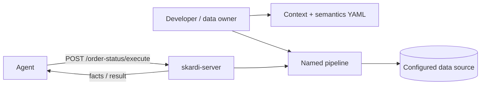

# Context boundaries for agents

Skardi is a context layer between an agent and the data it needs. It does
not decide what an agent should do or make a database safe by itself. It
gives developers a place to declare the data an agent may use, what that
data means, and which recurring tasks can be exposed as shared tools.

The goal is practical: an agent investigating a task should receive the
facts it needs, rather than a schema dump, a full data export, or broad
database credentials in its prompt.

## What exists today

Skardi's current building blocks are deliberately small:

| Building block | What it does today |
| --- | --- |
| Context YAML | Registers the sources available to Skardi and sets their access mode. Sources are read-only unless `access_mode: read_write` is explicitly configured. |
| Semantics YAML | Adds developer-reviewed, plain-language descriptions for sources and columns. It is returned by `GET /data_source` and visible through `skardi query --schema`. |
| CLI query | Lets an operator or local agent run SQL against a configured context without starting a server. |
| Pipeline YAML | Defines a named, parameterized SQL task. `skardi-server` exposes that task as `POST /<name>/execute`; the CLI can run it as well. |
| Jobs | Runs declared async work and records that job's lifecycle in a SQLite jobs ledger. This is not a complete record of every Skardi action. |

These pieces are useful together, but they are not a general policy engine.

## A controlled database path

For a recurring agent task, use four steps:

1. **Register only the source needed for the task.** Keep it read-only by default.
2. **Add business semantics.** A developer or data owner reviews what the tables, columns, and metrics mean. An agent may draft the text, but should not be the final authority.
3. **Declare the recurring task as a pipeline.** Parameterize the time range, account, or other variables instead of passing a broad connection string to the agent.
4. **Return the result to the caller.** The server runs the named pipeline; it does not expose a general SQL endpoint.

For example, an order-support agent can call an `order-status` pipeline
with a date range. The agent receives the status counts and the semantic
description needed to interpret them, while the database remains behind a
reviewed source definition and a declared task interface.

## Current boundary

The following statements are intentionally narrow.

**Skardi can currently help you:**

- keep source registration and business descriptions in inspectable YAML;
- expose a common task as a named pipeline over HTTP or the CLI;
- keep a source read-only by default and require an explicit source setting
  before DML is allowed;
- reject DDL in pipeline configuration when the server loads it;
- inspect registered source schema and descriptions before choosing a task.

**Skardi does not currently provide:**

- per-agent or per-user access permissions;
- system-wide row- or column-level access policies;
- a complete audit trail for every query and write;
- rollback, branching, or data-lineage workflows;
- an MCP binding, a Cloud-hosted coordination service, or automatic
  recommendations that turn observed traffic into pipelines.

Do not infer these guarantees from the fact that a source is configured as
read-only. `read_only` is a source access setting, not a substitute for an
organization's database permissions, network boundary, or review process.

## Pipelines are shared task interfaces, not every query

Pipelines are the shared-server path for recurring work. They make a task
inspectable and reusable: the name, SQL, parameters, and configured
sources are declared before an agent calls it.

The local CLI also supports direct SQL against a context. That is useful
for development and exploration, but it is different from giving an agent
a declared shared interface. Choose the latter when you need a repeatable
task boundary; do not claim that Skardi currently enforces a separate
identity-based policy for every caller.

See [pipelines.md](pipelines.md) for the YAML and invocation reference,
[semantics.md](semantics.md) for the business-meaning contract, and
[server.md](server.md) for the HTTP boundary.
